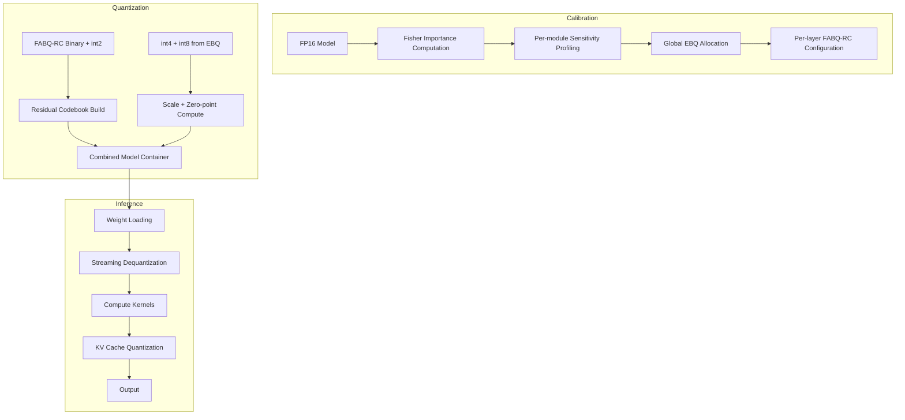

# Unified Quantization Architecture: FABQ-RC + EBQ

**Date:** 2026-05-04  
**Status:** Draft  
**Purpose:** Tie together FABQ-VP and EBQ into a coherent research agenda

---

## 1. Two Directions, One Goal

The original FABQ-RC research produced a novel 1-bit quantization method:
- Fisher-weighted channel importance
- Adaptive per-layer blocksize  
- Residual codebook for systematic bias correction

The message proposes extending this to a variable-precision paradigm with two complementary directions:

```
                    ┌─────────────────────────────────────────┐
                    │     Unified Quantization Framework      │
                    └─────────────────────────────────────────┘
                                    │
                    ┌───────────────┴───────────────┐
                    ▼                               ▼
         ┌──────────────────┐            ┌──────────────────┐
         │   FABQ-VP        │            │      EBQ         │
         │ Variable Preci-  │            │  Error-Budget    │
         │ sion Extension   │            │  Allocation      │
         │ (extends 1-bit   │            │ (global          │
         │  to 2-8 bits)    │            │  optimization)   │
         └──────────────────┘            └──────────────────┘
                    │                               │
                    └───────────────┬───────────────┘
                                    ▼
                    ┌─────────────────────────────────────┐
                    │    Combined System: FABQ-RC + EBQ   │
                    │                                     │
                    │  • FABQ-RC for binary/int2 comps    │
                    │  • EBQ for int4/int8/FP16 comps     │
                    │  • Unified calibration + storage    │
                    └─────────────────────────────────────┘
```

---

## 2. Architecture Overview

### 2.1 Precision Pyramid

The combined system uses a precision hierarchy:

```
Bit-width
   16 ──────────────────────────────────────────────── FP16 (layernorm, embeddings)
   8 ──────────────────────────────────────────────── int8 (critical channels)
   4 ─────────────────────────────────────────────── int4 (medium importance)
   2 ─────────────────────────────────────────────── int2 (FABQ-RC style)
   1 ─────────────────────────────────────────────── binary ±1 (FABQ-RC)
```

### 2.2 Component Allocation

| Precision | Allocation Method | Storage | Correction |
|-----------|------------------|---------|------------|
| FP16 | LayerNorm always | Full 16-bit | None |
| int8 | FABQ-RC: top 5% by Fisher | Packed int8 | None (already high) |
| int4 | EBQ: global optimization | Packed nibbles | Per-group scales |
| int2 | FABQ-RC: adaptive blocksize | Packed 2-bit | Residual codebook |
| binary | FABQ-RC: adaptive blocksize | Bit vectors | Residual codebook |

### 2.3 Data Flow



---

## 3. Storage Format

### 3.1 Container Structure

```python
@dataclass
class FABQEBQContainer:
    """Combined FABQ-RC + EBQ model format."""
    
    # Format identification
    format_version: int = 2  # v1=FABQ-RC only, v2=combined
    model_name: str
    
    # Architecture
    hidden_size: int
    num_layers: int
    num_attention_heads: int
    intermediate_size: int
    
    # Global config (EBQ decisions)
    target_bpw: float
    ppl_budget_epsilon: float
    calibration_dataset: str
    
    # Per-layer configs
    layers: List[LayerConfig]
    
    # Codebooks (FABQ-RC style)
    binary_residual_codebook: np.ndarray  # (256, block_size)
    int2_residual_codebook: np.ndarray    # (256, block_size)
    
    # Weight data (packed)
    weight_packed: bytes
    
    # Scale data
    scales: bytes  # FP16 scales for all quantized tensors
```

### 3.2 Per-Layer Config

```python
@dataclass
class LayerConfig:
    layer_idx: int
    
    # FABQ-RC components (binary + int2)
    binary_blocksize: int  # {16, 32, 64, 128, 256}
    int2_blocksize: int    # {32, 64, 128}
    binary_channel_mask: bytes  # which channels are binary vs int2
    
    # EBQ components (int4 + int8)  
    qkv_bits: int        # {4, 8}
    mlp_bits: int       # {4, 8}
    qkv_group_size: int # {32, 64, 128}
    mlp_group_size: int
    
    # Salient channels (FP16 protected, like AWQ)
    salient_indices: List[int]  # channels kept at higher precision
    
    # LayerNorm always FP16 (not stored)
    
    # Offsets into weight_packed for this layer
    q_weight_offset: int
    k_weight_offset: int
    v_weight_offset: int
    o_weight_offset: int
    gate_weight_offset: int
    up_weight_offset: int
    down_weight_offset: int
```

---

## 4. Calibration Pipeline

### 4.1 Phase 1: Fisher Importance (FABQ-RC)

```python
def phase1_fisher_importance(model, calibration_data, device):
    """
    Compute Fisher information per output channel.
    This feeds both FABQ-RC allocation and EBQ salient channel detection.
    """
    model.eval()
    fisher accumulators per module
    
    for batch in calibration_data:
        # Forward pass
        outputs = model(batch)
        loss = F.cross_entropy(outputs, batch['labels'])
        
        # Backward pass
        loss.backward()
        
        # Accumulate gradient² per channel
        for name, module in model.named_modules():
            if isinstance(module, nn.Linear):
                grad_sq = module.weight.grad ** 2
                module._fisher_acc += grad_sq.sum(dim=1)
        
        model.zero_grad()
    
    return fisher_per_module
```

### 4.2 Phase 2: EBQ Sensitivity Profiling

```python
def phase2_sensitivity_profiling(model, fisher_info, calibration_data, device):
    """
    Measure perplexity impact of different bit-widths per module.
    This determines EBQ's global allocation.
    """
    sensitivities = {}
    
    # Only profile a subset of layers for speed
    layers_to_profile = select_representative_layers(model, n=10)
    
    for name in layers_to_profile:
        base_ppl = measure_ppl_with_module_quantized(
            model, name, fp16, calibration_data
        )
        
        for bits in [2, 3, 4, 6, 8]:
            for quantizer in ['per_channel', 'per_group_64', 'per_group_128']:
                ppl = measure_ppl_with_module_quantized(
                    model, name, bits, quantizer, calibration_data
                )
                sensitivities[name][f"{bits}b_{quantizer}"] = {
                    'ppl_delta': ppl - base_ppl,
                    'size_bytes': compute_storage_size(name, bits, quantizer)
                }
    
    return sensitivities
```

### 4.3 Phase 3: FABQ-RC Blocksize Selection

```python
def phase3_blocksize_selection(model, fisher_info, calibration_data):
    """
    For binary and int2 components, select optimal blocksize per layer.
    This is FABQ-RC's adaptive blocksize logic.
    """
    blocksizes = {}
    
    for name, module in model.named_modules():
        if not isinstance(module, nn.Linear):
            continue
        
        weights = module.weight.data
        fisher = fisher_info[name]
        
        # Binary blocksize sweep
        best_binary_bs = 128
        best_binary_err = float('inf')
        
        for bs in [16, 32, 64, 128, 256]:
            err = fisher_weighted_reconstruction_error(
                weights, fisher, bs, 'binary'
            )
            if err < best_binary_err:
                best_binary_err = err
                best_binary_bs = bs
        
        blocksizes[name] = {'binary_bs': best_binary_bs}
        
        # int2 blocksize sweep
        if has_int2_channels(name):  # determined by pyramid fractions
            best_int2_bs = 64
            best_int2_err = float('inf')
            
            for bs in [32, 64, 128]:
                err = fisher_weighted_reconstruction_error(
                    weights, fisher, bs, 'int2'
                )
                if err < best_int2_err:
                    best_int2_err = err
                    best_int2_bs = bs
            
            blocksizes[name]['int2_bs'] = best_int2_bs
    
    return blocksizes
```

### 4.4 Phase 4: Residual Codebook Building

```python
def phase4_residual_codebook(model, calibration_data):
    """
    Build FABQ-RC style residual codebooks for binary and int2 components.
    """
    codebooks = {'binary': None, 'int2': None}
    
    # Binary residuals
    binary_residuals = []
    int2_residuals = []
    
    for batch in calibration_data[:100]:  # subsample for speed
        for name, module in model.named_modules():
            if not isinstance(module, nn.Linear):
                continue
            
            # Binary quantization + residual
            weights = module.weight.data
            blocks = partition_into_blocks(weights, blocksize[binary_bs])
            binary_q = quantize_binary(blocks)
            residual = weights - binary_q
            binary_residuals.extend(residual)
            
            # int2 quantization + residual (if applicable)
            if has_int2_channels(name):
                int2_q = quantize_int2(blocks)
                residual = weights - int2_q
                int2_residuals.extend(residual)
    
    # Cluster into codebooks
    if binary_residuals:
        codebooks['binary'] = kmeans(
            binary_residuals, n_clusters=256, blocksize=binary_bs
        )
    
    if int2_residuals:
        codebooks['int2'] = kmeans(
            int2_residuals, n_clusters=256, blocksize=int2_bs
        )
    
    return codebooks
```

---

## 5. Research Agenda

### 5.1 Timeline

```
Week 1: FABQ-RC Validation
├── Fix padded-block centroid bug
├── Run full evaluation
└── Confirm baseline numbers

Week 2-3: FABQ-VP Prototype
├── Extend precision allocation to 5 levels
├── Implement multi-level residual codebooks  
├── Test on TinyLlama (fast iteration)
└── Verify ~3-4 bpw works well

Week 4-5: EBQ Integration
├── Implement sensitivity profiler
├── Implement greedy knapsack allocator
├── Integrate with FABQ-VP storage format
└── Profile on small model first

Week 6-7: Qwen 35B Experiments
├── Load Qwen 35B FP16
├── Run full calibration pipeline
├── Generate variable-precision quantization
└── Evaluate perplexity + downstream

Week 8+: Iteration
├── Analyze failure modes
├── Refine allocation algorithm
├── Try alternative quantizers (GPTQ, AWQ)
└── Write up results
```

### 5.2 Key Experiments

| Experiment | Hypothesis | Success Metric |
|-----------|-----------|----------------|
| FABQ-VP pyramid fractions | 5-level pyramid beats uniform 3-bit | Perplexity vs baseline |
| EBQ vs fixed allocation | Global optimization beats layer-type heuristics | Perplexity at same bpw |
| Binary residual codebook | k-means residual correction helps vs no correction | Perplexity delta |
| Combined vs FABQ-VP alone | Adding EBQ's int4/int8 optimization helps | Perplexity at same bpw |
| KV cache quantization | 4-bit KV works for Qwen 35B | Long-context PPL |

### 5.3 Expected Outcomes

- **FABQ-VP at 3 bpw**: Should match or beat AWQ 4-bit baseline for Qwen 35B
- **FABQ-VP at 2 bpw**: Should be competitive with Q4_K_M while using less memory
- **EBQ allocation**: Should show 0.5-1.0 perplexity improvement over naive uniform allocation at same bpw
- **Combined system**: Should enable RAM-only inference for 35B models with minimal quality loss

---

## 6. Implementation Roadmap

### 6.1 Code Structure

```
fabq-rc/
├── FABQ_RC_SPEC.md           # Original FABQ-RC specification
├── FABQ_VP_SPEC.md           # Variable precision extension
├── EBQ_SPEC.md               # Error-budget allocation
├── UNIFIED_SPEC.md           # This file
│
├── src/
│   ├── calibration/
│   │   ├── fisher.py         # Fisher importance computation
│   │   ├── sensitivity.py     # Per-module sensitivity profiling
│   │   └── kv_profile.py      # KV cache sensitivity
│   │
│   ├── allocation/
│   │   ├── pyramid.py         # FABQ-VP precision pyramid
│   │   ├── knapsack.py        # EBQ greedy allocation
│   │   └── blocksize.py       # FABQ-RC adaptive blocksize
│   │
│   ├── quantization/
│   │   ├── binary.py          # FABQ-RC binary quantization
│   │   ├── int2.py            # int2 quantization
│   │   ├── int4.py            # int4 quantization  
│   │   └── int8.py            # int8 quantization
│   │
│   ├── codebook/
│   │   ├── residual.py        # FABQ-RC residual codebook
│   │   └── multi_level.py     # FABQ-VP multi-level codebooks
│   │
│   ├── storage/
│   │   ├── container.py       # Container format
│   │   └── packing.py         # Bit packing utilities
│   │
│   └── inference/
│       ├── cpu_kernel.py      # CPU inference kernels
│       ├── dequant.py         # Streaming dequantization
│       └── kv_cache.py        # KV cache management
│
├── notebooks/
│   ├── FABQ_RC.ipynb          # FABQ-RC original experiments
│   ├── FABQ_VP.ipynb          # Variable precision experiments
│   └── EBQ_Profile.ipynb      # Sensitivity profiling
│
└── plans/
    ├── FABQ-VP-SPEC.md
    ├── EBQ-SPEC.md
    └── UNIFIED-SPEC.md         # This file
```

### 6.2 Dependency Graph

```
FABQ_RC_SPEC.md
    │
    ▼
FABQ-VP-SPEC.md ────────────────▶ FABQ_VP.ipynb
    │ (extends)                        │
    │                                  │
EBQ-SPEC.md ◀─────────────────────────┘
    │ (uses same calibration)
    │
    ▼
UNIFIED-SPEC.md ─────────────────▶ Unified implementation
    │
    ▼
Combined calibration pipeline
    │
    ├──▶ FABQ_RC components (binary + int2)
    └──▶ EBQ components (int4 + int8)
```

---

## 7. Open Questions for User

1. **FABQ-RC bug fix status** — is the padded-block centroid bug fix complete? Should we prioritize validation before extending?

2. **Target model preference** — start with TinyLlama (fast iteration) or go straight to Qwen 35B (actual target)?

3. **FABQ-VP pyramid tuning** — should we learn the pyramid fractions from data, or use hand-tuned starting points?

4. **EBQ second-order effects** — greedy allocation ignores module interactions. Do you want iterative refinement, or is greedy sufficient for a research prototype?